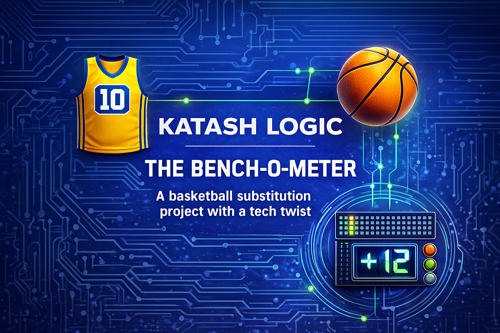

# KATASH LOGIC  
## THE BENCH-O-METER  

A real-time basketball momentum & fitness–based substitution analyzer implemented on the Basys3 FPGA.

## Overview
Katash Logic – The Bench-O-Meter is a personal home project designed to analyze
real-time momentum for basketball players and recommend when a player should rest
or stay on the court.

The system combines:
1. In-game performance (momentum)
2. Pre-game fitness levels and player roles (fitness score)

Inspired by Oded Katash’s flow-based coaching style.

## Project Goal
Build an FPGA-based system that receives basketball events as inputs, 
calculates momentum and fitness in real time, and outputs a substitution recommendation.

## Current Status
🟡 **Planning Phase**  
The Basys3 board has not arrived yet.  
System logic, formulas, and architecture are currently being designed.

## Documentation  
Full details can be found in the `/docs` folder:

- [System Architecture Diagram](docs/system_architecture_v0.md)  
- [Momentum Formula (v1.1)](docs/momentum_formula_v1.md)  
- [Fitness Formula (v1.0)](docs/fitness_formula_v1.md)  
- [Combined Decision Logic (v1.0)](docs/combined_decision_v1.md)

## Planned Development Steps
- Write full project specification  
- Finalize momentum calculation algorithm  
- Finalize fitness model and role adjustments  
- Build complete architecture diagram  
- Design first FPGA modules (clock divider, input interface)  
- Start experiments once Basys3 arrives  
- Implement momentum calculator in VHDL  
- Add simulation testbench  
- Integrate all modules  
- Test on hardware  

## Roadmap
- [x] Create GitHub repository  
- [x] Add initial README  
- [x] Add basic project specification (v0)  
- [x] Add momentum, fitness, and decision formulas  
- [x] Add system architecture diagram (Mermaid)  
- [ ] Begin module design (clock, input, state machine)  
- [ ] Start Basys3 experiments when board arrives  
- [ ] Implement momentum calculator  
- [ ] Add simulation testbench  
- [ ] Integrate logic and test on hardware  
