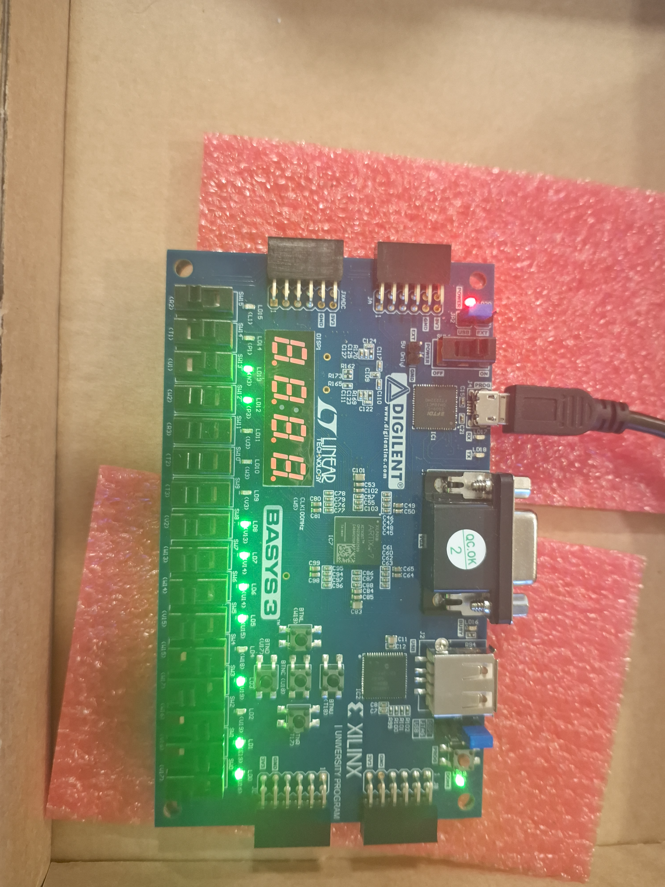

# 🏀 Katash Logic – The Bench-O-Meter  
### FPGA-Based Basketball Substitution Decision System

A real-time **basketball substitution decision engine** implemented on a **Basys3 FPGA** using **VHDL**.

The project analyzes **player momentum, fatigue, and fouls** in real time and outputs
a clear recommendation:

**KEEP ON COURT / SUGGEST REST / MUST SUBSTITUTE**

Inspired by Oded Katash’s flow-based coaching philosophy.

---

## 🧩 Live FPGA System (Basys3)

---

## 🎥 Live FPGA Demonstration

▶️ **Watch the live hardware demo:**  
https://youtu.be/OXzw-mD9zPI

The video shows the full system running **on real FPGA hardware**, including:
- Event input via switches and buttons  
- Real-time momentum accumulation  
- Fatigue build-up and recovery  
- Foul counting  
- Decision logic  
- Substitution finite state machine (FSM)  
- Visual feedback via onboard LEDs  

---

## 📌 Project Overview

**Katash Logic – The Bench-O-Meter** is a personal FPGA project designed to explore
how real-time hardware logic can support coaching decisions.

The system answers a single question:

> *Should this player stay on the court, rest, or be substituted?*

All decisions are made **fully in hardware**, without a CPU or software loop.

---

## 🧠 What the System Evaluates

The substitution decision is based on:

- **Momentum**  
  Accumulated from positive and negative basketball events

- **Fatigue**  
  Time-based accumulation while on court, with gradual recovery during rest

- **Fouls**  
  Per-player foul counting with warning and forced-substitution thresholds

- **Game State**  
  Active / paused / player on court

- **Grace Period**  
  Short stabilization window after entering the court

---

## ⚙️ Implemented on Hardware

All of the following are implemented, synthesized, and tested on a **Basys3 FPGA**:

✔ Event decoder (edge-safe)  
✔ Per-player momentum accumulation (parallel)  
✔ Fatigue counter (time-based)  
✔ Foul counter  
✔ Multi-factor decision logic  
✔ Substitution finite state machine (FSM)  
✔ Grace period handling  
✔ LED-based live visualization  

This is **not a simulation-only project** — the full pipeline was validated on real hardware.

---

## 🧪 Hardware Behavior Highlights

- Positive actions increase player momentum  
- Fatigue increases while a player is on the court  
- Fatigue decreases while resting  
- Fouls trigger warnings and forced substitution  
- FSM transitions are deterministic and explainable  
- System stabilizes after substitutions using a grace window  

---

## 📂 Repository Structure

assets/
│── katash_logic_banner.png
│── basys3_live.png
│── hardware_photos/
│
docs/
│── momentum_formula_v1.md
│── fitness_formula_v1.md
│── combined_decision_v1.md
│── system_architecture.md
│
src/
│── top.vhd
│── event_decoder.vhd
│── player_momentum.vhd
│── team_momentum.vhd
│── final_momentum.vhd
│── fatigue_counter.vhd
│── foul_count.vhd
│── decision_logic.vhd
│── substitution_fsm.vhd
│── clock_divider.vhd
│
README.md

---

## 🎯 Project Scope (Current Status)

This repository represents a **completed learning milestone**:
- End-to-end real-time system  
- Clean separation of datapath and control  
- Practical FPGA debugging  
- FSM-driven decision logic  

Future extensions (UI, displays, simulations) were intentionally left out to keep
the project focused and complete.

---

## 📜 License

MIT License
