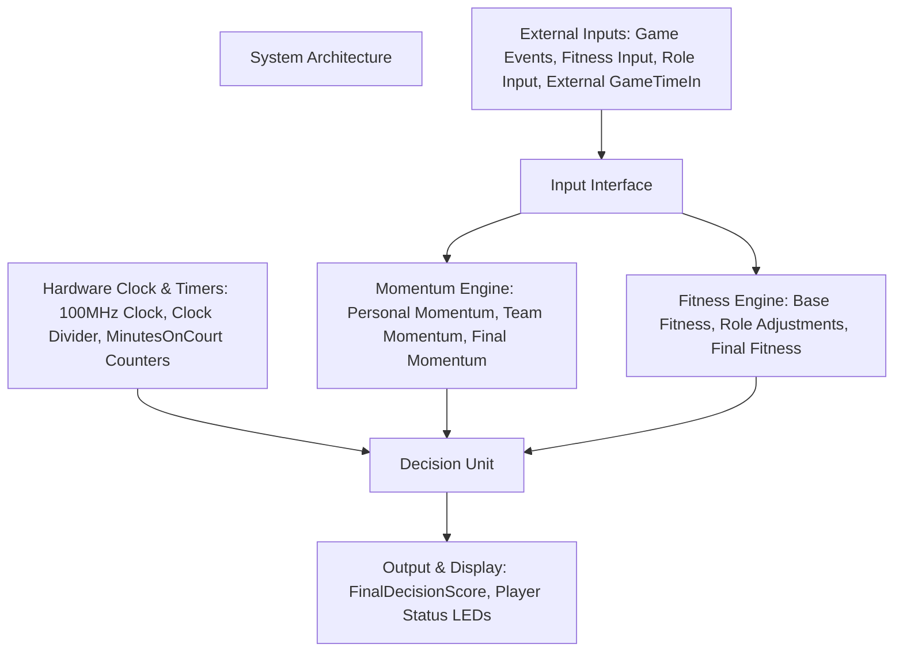

# System Architecture – Version 0

This document describes the high-level architecture of the FPGA-based
Basketball Momentum Substitution System implemented on the Basys3 board.

The design is intentionally simple and modular, suitable for a home project,
but still structured like a real FPGA system.

---

## 1. External Inputs (User-Controlled)

These inputs come **from outside the FPGA** and enter the system through the Input Interface:

- **Game Events:** score, miss, rebound (off/def), foul, steal, block, turnover, etc.
- **Player Fitness Input:** a 1–10 rating entered before the game.
- **Player Role:** Star / Key / Role / Bench.
- **External Game Clock (GameTimeIn):**  
  The real game time is NOT generated by the FPGA.  
  Instead, the user provides the current time or time updates during the game.

These external signals represent the real-world game information.

---

## 2. Internal FPGA Timing (Hardware Clock & Timers)

Separate from the external game time, the FPGA uses its own hardware clock:

- Basys3 onboard clock: **100 MHz**
- A **Clock Divider** generates a slow internal timing signal (e.g., 1 Hz)
- Internal timers track:
  - **MinutesOnCourt** for each player (used for fatigue penalty)
  - Stable pacing for the system’s decision cycle

Important:  
This internal clock does **not** represent real game time.  
It only provides stable timing for calculations and fatigue tracking.

---

## 3. Input Interface

This block receives all external inputs and converts them into clean binary signals:

- Encodes event types (EventCode)
- Identifies which player the event belongs to (PlayerID)
- Encodes role and fitness input
- Passes external game time (GameTimeIn) unchanged into the system

This ensures that all data entering the system is structured and reliable.

---

## 4. Momentum Engine

Implements the full momentum calculation (v1.1):

- Computes **PersonalMomentum** based on weighted game events  
- Computes **TeamTotalMomentum** for the 5 active players  
- Computes **TeamRelativeMomentum**  
- Outputs **FinalMomentum** for each player  

This module reflects real-time performance.

---

## 5. Fitness Engine

Implements the fitness calculation (v1.0):

- Converts user fitness input to **BaseFitnessValue**
- Applies player role using **RoleFactor**
- Computes **RoleAdjustedFitness**
- Computes **TeamFitnessTotal** and **RelativeFitness**
- Outputs **FinalFitness** for each player

This module reflects pre-game expectations.

---

## 6. Decision Unit

This block combines momentum and fitness into a single decision score:

- **Delta = FinalMomentum − FinalFitness**
- **FoulPenalty**: based on regular and offensive fouls  
- **FatiguePenalty**: based on continuous MinutesOnCourt  
- Final output: **FinalDecisionScore**

The unit then maps the score to a substitution recommendation:

- HOT – keep on court  
- Playing well  
- Neutral  
- Suggested rest  
- Must substitute  

---

## 7. Output & Display Unit

Presents system recommendations to the user:

- FinalDecisionScore on 7-segment display or LEDs  
- Simple indicators (HOT / NORMAL / REST)  
- Can later include PlayerID or overall team status

---

## Block Diagram

 
